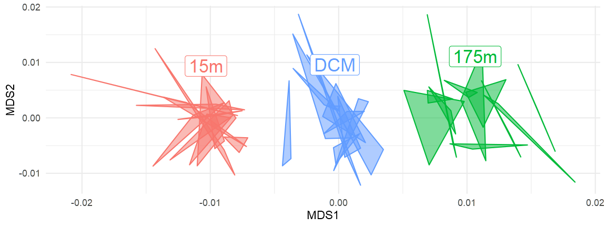
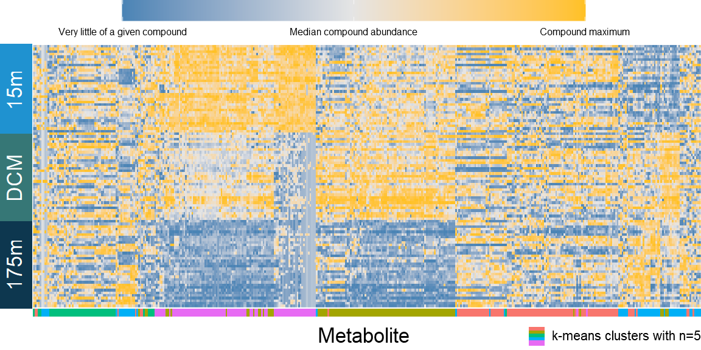
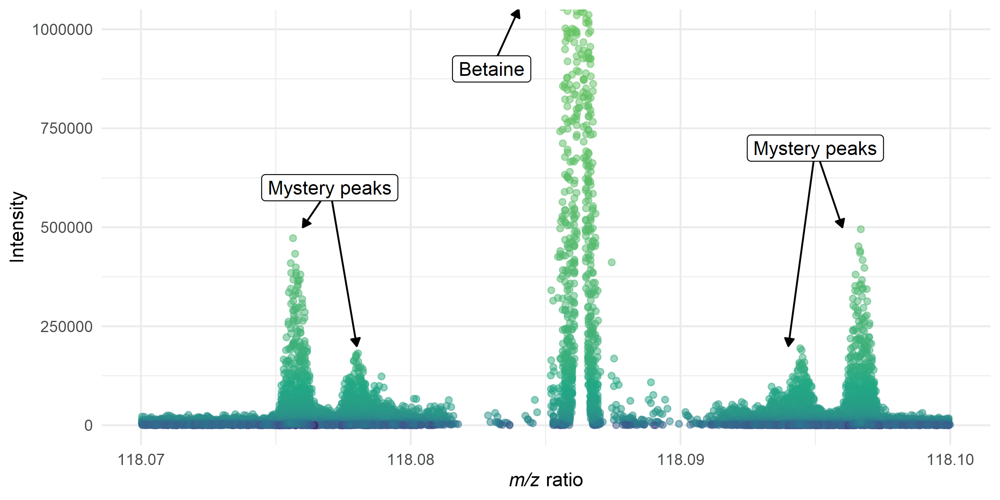

# Reproducible code, figures, and sh...tuff. cod-fi-sh!

I spent way too much time recreating old code and figures and trying to hack together everyone else's workflow, so I'm making this repo to collect those final products in a single spot instead of various other places. Ideally I'd like this to be a code library of sorts where others can go to see how I've made figures, performed analyses, or performed some bit of exceptional wizardry.

There's one golden rule: reproducibility. If it breaks when I try to run it, it gets thrown out. I am tired of chasing down the original data, reformatting it so the code actually runs, debugging the output, and still ending up with a different result than the initial product. To this end, I outline below a template for individual folders within this repo that establish how and what to include.

## Template repo structure:
#### README.md
  - This is absolutely required. I recommend creating these READMEs via Rmarkdown doc with the "output" set to "github_document" so it renders nicely on GitHub. This file MUST include the expected output in a stable format. For example, if your code produces a figure, the README must include a png (or jpg, or whatever image format you adore). Should NOT include code, so use `knitr::opts_chunk$set(echo = FALSE)` in your setup chunk to avoid shoving all your code at us.

#### data
  - For all your (small, <5MB per file) data. If it's too big, shrink it down until it fits under the size limit by removing entries, or (less ideally) compressing the data. I can guarantee you that the output produced does *not* require your whole 300MB output folder. We're going for single figures and bite-size code chunks, not entire analyses. Choose a well-defined stopping point where the data is clean and small and upload that rather than raw output of any kind.

#### code
  - Ideally, this folder is unnecessary because everything should fit in a single script.
  - If you include a "code" folder then you MUST also include a script in the repo that sources all of the individual scripts in this folder. Again, if it breaks when I try to run it I'm throwing it out.
  
#### fig_variants
  - This folder is useful if you'd like to document a few variants of the main figure you're showing off. Again, only include ONE example in the README and store the others here. Should contain descriptive file names connecting source files to variants.
  
#### script.R (or script.py or script.sh)
  - The actual code that creates the analysis. Should be short, sweet, and commented.

#### README.Rmd
  - Not required but recommended so you don't have to hand-edit your README and can instead use knitr to create it. Set the `output` to `github_document` so it renders nicely here, and make sure it's named README so GitHub will render it in the repo subdirectories.
  - Again, we don't want to be showing code in the README so use `knitr::opts_chunk$set(echo = FALSE)` in your setup chunk. If you *absolutely need* to show off a particular snippet of code, you can manually enable the echo for a chunk.

#### fignamewhatever.Rproj
  - Again, not required but highly convenient for others trying to run your code.

## Forbidden techniques
  - Manual file paths. I'm tempted to set up a GitHub action that prevents pull requests with manual file paths in them but I don't know how to do that yet.
  - Custom libraries. If I need to install something that you and only you have on your machine, guess what? It's not going to work and you've broken the golden rule so it'll get thrown out
  - Code requiring edits to PATH or other system file. You could have the coolest code in the world but if it means I have to change my computer state I'm not including it. If this is what your code requires, you'll have to write some auto-detection software to find it and make it **very** clear that this is required in the README. If I don't notice it and fail to install your very special external software and it breaks, I'm removing it.
  - User inputs. No `readline`, no "Hit next to continue", no "click to select subregion". You're making a single output, not an application.
  - More to be determined as I break things.

## Recommended techniques
  - Use `ggsave` or `png` with a specific width/height/dpi arguments. Keeps outputs actually identical and doesn't depend on RStudio's window size when exporting/saving. Ideally the outputs should have a width of either 8 inches or 4 inches to fit nicely in the gallery.
  - Use `set.seed` for anything that requires randomness (NMDS, k-means, etc.). Actually, probably best to set this for things that don't even clearly require randomness.
  - Load libraries at the beginning and avoid `::` notation.

## Gallery

This gallery is updated whenever I feel like it because I manually go through the top-level folders and find the .png and .jpg output files.

---

---

---

---

---

---

