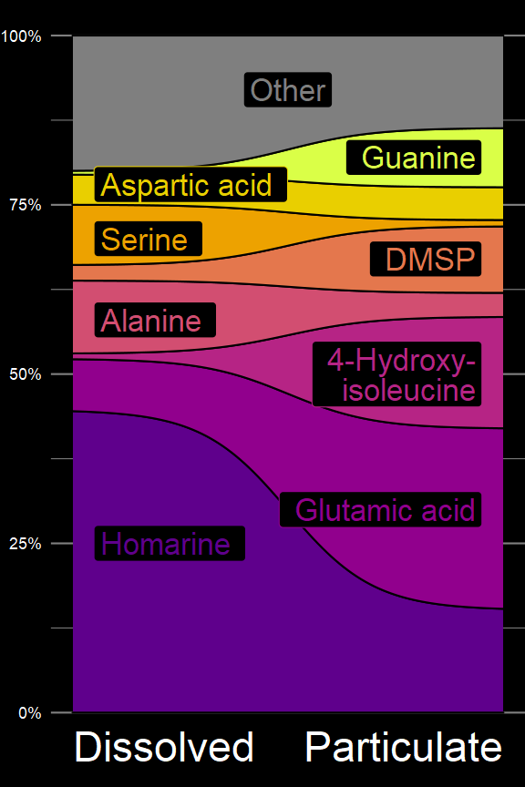

Dissolved and particulate comparison
================
William Kumler
4/25/2022

## REPRODUCIBILITY NOTE:

This figure requires a custom library that’s published on Github but NOT
on CRAN. The `ggbarribbon` library is one I wrote for the Ingalls Lab
and can be found at <https://github.com/IngallsLabUW/ggbarribbon>.
Installation should be done via the `devtools` package with the below
code:

    devtools::install_github("https://github.com/IngallsLabUW/ggbarribbon")

## Motivation

This is a figure that I made for my ARCS poster, presented on May 1st
2022. It’s often difficult to get the data all shaped exactly the way we
want it to and there’s several `tidyverse` tricks that I thought would
be worth documenting.

Also, this gave me a chance to show off the `ggbarribbon` library that I
made a while ago to create nice curvy interpolations between points as a
pseudo-alluvial plot.

## Tricks used

Again, nothing super magical in this one - mostly just a bunch of
ggplot2 hacks. Lots of manual labelling with `scale_*_manual` and manual
specification of label coordinates.

-   `ggbarribbon`’s `geom_bar_ribbon`
-   `scales::label_percent()` for percentages
-   Passing `hjust` as an *aesthetic* to left justify text on left side
    and right justify text on right side
-   The absolute maximum of `theme()` commands to fine-tune parameters

## Data

Data were passed off to me from Josh via Slack, so I don’t have a lot of
details about the collection/integration methods themselves.
`Heal_G1_data` is originally from Katherine’s Gradients 1 data but (I
think) has been significantly shaped. Originally integrated in Skyline?
`CX_EnviroConc_supptable6` comes from Josh’s cation-exchange dissolved
manuscript (in prep as of April 2022). Originally integrated in Skyline
as well, I believe. I only end up using the ALOHA data from both of
these.

## Output

