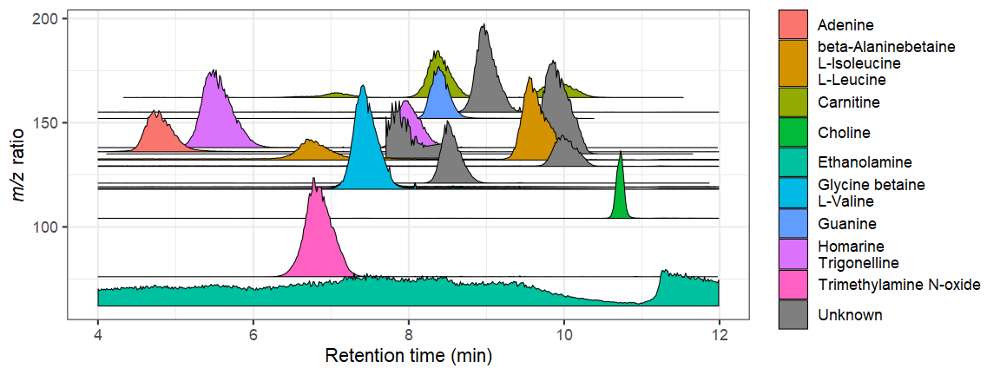

Using ggridges with MS data
================
William Kumler
2/17/2022

## Motivation

Sometimes it’s just nice to create a beautiful visualization of MS data
and accurately represent it in 3D space to convey some sense of the
complexity involved in our analyses. `ggridges` is a package that I
really like for this purpose because it can convey three dimensions,
while traditional density plots overlay the various peaks on top of each
other. However, it also has some quirky behavior at low ridgeline values
so I’ve made a manual version using `geom_polygon` to get more control
over the plots.

## Output



## About the data

The mass traces I show here were extracted from a random environmental
sample that we had laying around. Of course, the original mzML was too
large to host on GitHub so I shrank it using RaMS and the top 20 masses
in the file with the below code.

``` r
library(tidyverse)
library(RaMS)
library(R.utils)

msdata <- grabMSdata("180205_Poo_TruePoo_Full2.mzML")
mz_group <- function(mz_vals, ppm){
  group_vec <- numeric(length(mz_vals))
  group_num <- 1L
  init_vec <- mz_vals
  names(init_vec) <- seq_along(init_vec)
  for(i in 1:20){
    mz_i <- init_vec[1]
    err <- mz_i*ppm/1000000
    mz_idxs <- init_vec>mz_i-err & init_vec<mz_i+err
    group_vec[as.numeric(names(mz_idxs)[mz_idxs])] <- i
    init_vec <- init_vec[!mz_idxs]
  }
  group_vec
}

cmpd_data <- msdata$MS1 %>%
  arrange(desc(int)) %>%
  filter(rt>1 & rt<20) %>%
  filter(mz<200) %>%
  mutate(mz_group = mz_group(mz, 50)) %>%
  filter(mz_group>0) %>%
  group_by(mz_group) %>%
  summarize(mz=mean(mz)) %>%
  filter(!mz%between%pmppm(123.0405, 50)) %>%
  filter(!mz%between%pmppm(164.06681, 50)) %>%
  filter(!mz%between%pmppm(144.9821, 50)) %>%
  filter(!mz%between%pmppm(182.0236, 50)) %>%
  filter(!mz%between%pmppm(148.1159, 50))
  

minifyMSdata(files = "180205_Poo_TruePoo_Full2.mzML",
             output_files = "data/180205_Poo_TruePoo_Full2_mini.mzML",
             mz_include = cmpd_data$mz, ppm = 50, warn=FALSE)
gzip("data/180205_Poo_TruePoo_Full2_mini.mzML", overwrite=TRUE)
```
